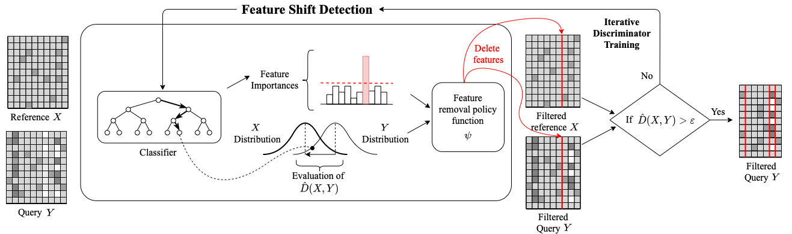
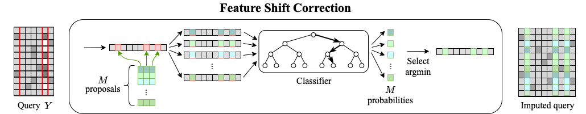

# DataFix


This repository contains a Python implementation of **DataFix**, a framework that uses the principles of adversarial learning, where the information from several discriminators trained to distinguish between two distributions is used to both detect the corrupted features and fix them in order to remove the distribution shift between a reference dataset and a query dataset. The reference dataset is assumed to contain high-quality data, while the query dataset may contain corrupted features that introduce a distribution shift.

DataFix consists of two systems: ***DF-Locate***, which localizes the features causing the distribution shift, and ***DF-Correct***, which modifies the query samples in order to reduce the distribution shift between the two datasets.

## Installalation

The library can be installed using pip:

```
$ pip install git+https://github.com/AI-sandbox/DataFix.git
```

To obtain a local copy of this Git repository, navigate to the desired folder and run the following command in the Command Line Interface (CLI):

```
$ git clone https://github.com/AI-sandbox/Datafix.git
```

## Dependencies

All the dependencies are listed in the `requirements.txt`. They can be installed via pip:

```
$ cd datafix
$ pip3 install -r requirements.txt
```

## DFLocate



### Parameters

```
estimator : ``Estimator`` instance, default=RandomForestClassifier(random_state=0)
    A supervised learning classifier with a ``fit`` method that provides
    information about feature importance through a ``coef_`` attribute or a
    ``feature_importances_`` attribute. The default estimator is
    `RandomForestClassifier` with a random state of 0.
cv : None, int, str, or an iterable, default=None
    Determines the cross-validation splitting strategy.
    Possible inputs for ``cv`` are:
    - None, to use the default single stratified train/test split
    :class:`StratifiedShuffleSplit`, with ``n_splits`` = 1, and
    ``test_size`` = ``test_size``.
    - int, to specify the number of folds of stratified K-fold
        cross-validation :class:`StratifiedKFold`.
    - An iterable with ``split`` method yielding (train, test) splits as
    arrays of indexes.
test_size : float or int, default=0.2
    Useful only when ``cv`` is None. If float, should be between 0.0 and 1.0
    and represent the proportion of the dataset to include in the test split.
    If int, represents the absolute number of test samples.
scoring : str or list, default='balanced_accuracy'.
    It specifies the metric(s) to evaluate the performance of the estimator. 
    The supported metrics can be found in `sklearn.metrics` or alternatively, 
    it can be one of the following:
    - ``D1``: log(p1) + log(1-p0).
    - ``D2``: log(p1 / p0).
    - ``D3``: -log((1/p0) - 1).
n_jobs : int, default=None
    Number of jobs to run in parallel. None means 1, unless in a
    joblib.parallel_backend context. -1 means using all processors.
return_estimator : bool, default=False
    Whether to return the estimators fitted on each split and iteration.
step : None, int or float, default=None
    If greater than or equal to 1, then step corresponds to the (integer)
    number of features to remove at each iteration. If within (0.0, 1.0),
    then step corresponds to the percentage (rounded down) of features to
    remove at each iteration, based on the number of remaining features.
    Note that the last iteration may remove fewer than step features in order
    to reach ``max_features_to_filter``. None means there is no limit in the
    (integer) number of features removed in each iteration.
percentage : None or float, default=0.1.
    To determine the maximum percentage of the total feature importances
    that can be removed at each iteration. The removal percentage is
    calculated as the specified percentage multiplied by
    `2·[balanced_accuracy_(t) - 0.5]`, where balanced_accuracy_(t) is the
    balanced accuracy of the estimator at iteration t. At a maximum, when
    the balanced accuracy is 1.0, the specified percentage of the total
    importances is removed. At a minimum, when the balanced accuracy is 0.5
    or lower, only a single feature is removed. None means there is no limit
    in the percentage of the total importances removed at each iteration.
alpha : None, int or float, default=1
    Used to define a threshold at ``alpha``/``n_features_t``, with
    ``alpha`` ≥ 1 and ``n_features_t`` being the number of features at
    iteration t. Only features with importance over the threshold are removed.
    The threshold adjusts dynamically based on the number of available
    features at each iteration. None means that the minimum feature
    importance of a feature to be removed needs to be above 0.
threshold : None, int or float, default=None
    Only features with importance over the threshold are removed. Unlike
    ``alpha``, the threshold is static. None means that the minimum feature
    importance of a feature to be removed needs to be above 0.
margin : None or float, default=0.01
    Stop condition based on balanced accuracy being less than 0.5 + ``margin``.
    None means balanced accuracy is not used as a stop condition, except
    if ``patience`` is not None.
max_features_to_filter : None, int or float, default=None
    If greater than or equal to 1, then max_features_to_filter corresponds
    to the maximum (integer) number of features to remove in total. If within
    (0.0, 1.0), then max_features_to_filter corresponds to the percentage
    (rounded down) of maximum features to remove in total. None means there
    is no limit in the maximum (integer) number of features to remove in
    total.
max_it : None or int, default=None
    Maximum number of iterations. None means there is no limit in the
    number of iterations.
patience : None or int, default=None
    Maximum number of iterations without improvement in balanced accuracy.
    None means balanced accuracy is not used as a stop condition, except
    if ``margin`` is not None.
random_state : None or int, default=None
    Controls randomness by passing an integer for reproducible output.
find_best : None or 'knee-balanced', default='knee-balanced'
    If 'knee-balanced', the optimal number of features to eliminate is
    determined by finding the knee of the curve representing the balanced
    accuracy of the estimator vs the number of removed features. None means
    the algorithm does not search for the optimal iteration; instead, it 
    returns the last iteration as the optimal one.
window_length : None or int, default=5
    Useful only when ``find_best`` == 'knee-balanced'. Used to determine the
    length of the filter window for Savitzky-Golay filter. The window length
    is computed as: `max(5, (delta*window_length)//2*2+1)`, where delta is
    the mean distance between ``corrupted_features_`` points.
polyorder : None or int, default=4
    Useful only when ``find_best`` == 'knee-balanced'. The polyorder used to
    fit the samples for Savitzky-Golay filter.
S : None or int, default=7
    Useful only when ``find_best`` == 'knee-balanced'. Sensitity for knee
    location. It is a measure of how many “flat” points are expected in
    the unmodified data curve before declaring a knee.  If the algorithm
    fails to detect a knee point, the sensitivity is gradually decreased
    until a solution is found. If no solution is found with the minimum
    sensitivity of 1, then the last iteration is considered the knee point.
online : None or bool, default=False
    Useful only when ``find_best`` == 'knee-balanced'. When set to True, it
    "corrects" old knee values if necessary.
verbose : bool, default=False
    Verbosity.
```

### Attributes

```
scores_ : dict
    split(k)_test_score : list of length (n_iters_)
        The cross-validation scores across (k)th fold.
    mean_test_score : list of length (n_iters_)
        Mean of scores over all folds.
    std_test_score : list of length (n_iters_)
        Standard deviation of scores over all folds.
    mean_test_balanced_accuracy_smooth : list of length (n_iters_)
        Mean balanced accuracy after smoothing with Savitzky-Golay smoothing,
        opening and truncation to 0.5. Only available after ``knee_location()``.
estimators_ : dict
    split(k)_estimator : list of length (n_iters_)
        The fitted estimator across (k)th fold. Only stored when
        ``return_estimator`` == True.
runtime_ : list of length (n_iters_)
    Runtime of each ``shift_detection()`` or ``shift_location()``
    iteration.
corrupted_features_ : list of length (n_iters_)
    Total number (cummulative) of features detected as being corrupted at
    each ``shift_location()`` iteration.
mask_ : list of length (n_features_in_)
    The mask of corrupted features, where 1 indicates a variable is
    corrupted and 0 otherwise.
ranking_ : list of length (n_features_in_)
    The iteration number when each feature is detected as being corrupted.
    Features not identified as corrupted at any iteration have zero value.
importances_ : list of length (n_features_in_)
    The normalized importance of a feature at the iteration when it is
    detected as being corrupted. The normalized importance is averaged
    over all folds. Features not identified as corrupted at any iteration
    have zero value.
n_corrupted_features_ : int
    Total number of features detected as being corrupted after
    ``shift_location()``.
n_iters_ : int
    Number of iterations performed.
n_features_in_ : int
    Number of input reference/query features.
feature_names_in_ : ndarray of shape (n_features_in_,)
    Names of input reference/query features. Only defined when the feature
    names are all strings and match between reference and query.
n_samples_reference_ : int
    Number of samples in reference.
n_samples_query_ : int
    Number of samples in query.
```

### Usage

```
from datafix import DFLocate

datafix_locate = DFLocate()
```

The ``shift_detection()`` method can be used to identify if there is a distribution shift between a reference dataset and a query dataset. First, an estimator is fit as a discriminator to distinguish between samples from the reference or the query. Then, the discriminator is evaluated on the test samples to determine if there is a divergence:

```
datafix_locate = datafix_locate.shift_detection(reference, query)
```

The ``shift_location()`` method can be used to iteratively localize the corrupted features in the query that cause a distribution shift between the query and the reference datasets.

```
datafix_locate = datafix_locate.shift_location(reference, query)
print("Mask of corrputed features:")
print(datafix_locate.mask_)
```

The ``plot_evolution()`` method can be used to plot the evolution curve of balanced accuracy and smoothed balanced accuracy versus the number of corrupted features removed. It can also plot the iteration or knee with the correct number of corrupted features. Additionally, it can optionally plot the F1 score curve.

```
datafix.plot_evolution()
```

## DFCorrect



### Parameters

```
num_corrupted_feats : int
    Total number of corrupted features.
base_classifier : object, default=CatBoostClassifier(verbose=False, random_state=0)
    The base classifier used as discriminator.
batch_size : int, default=5000
    The size of the batches used for processing the query dataset.
max_dims : int, default=None
    If there are more than `max_dims` features, up to `max_dims` features are 
    randomly selected from the correct features to speed up processing. None means 
    that all correct features are used for the correction of corrupted features.
verbose : bool, default=False
    Verbosity.
```

### Returns

```
query : array-like
    Query with corrected features.
```

### Usage

The ``fit_transform()`` method can be used to correct the corrupted features detected by DF-Locate.

```
from datafix import DFCorrect

datafix_correct = DFCorrect()
datafix_correct.fit_transform(reference, query)
```

## Citation

If you find this code useful in your research, please kindly cite our paper ([arxiv](https://openreview.net/forum?id=lBhRTO2uWf)) via:

> Barrabés, M., Montserrat, D. M., Geleta, M., Giró-i-Nieto, X., & Ioannidis, A. G. (2023, November). Adversarial Learning for Feature Shift Detection and Correction. In Thirty-seventh Conference on Neural Information Processing Systems. 

```bibtext
@inproceedings{barrabes2023adversarial,
  title={Adversarial Learning for Feature Shift Detection and Correction},
  author={Barrab{\'e}s, M{\'\i}riam and Montserrat, Daniel Mas and Geleta, Margarita and Gir{\'o}-i-Nieto, Xavier and Ioannidis, Alexander G},
  booktitle={Thirty-seventh Conference on Neural Information Processing Systems},
  year={2023}
}
```
